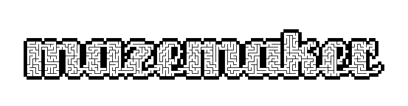
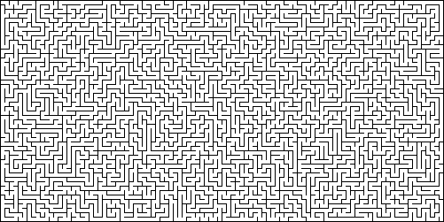
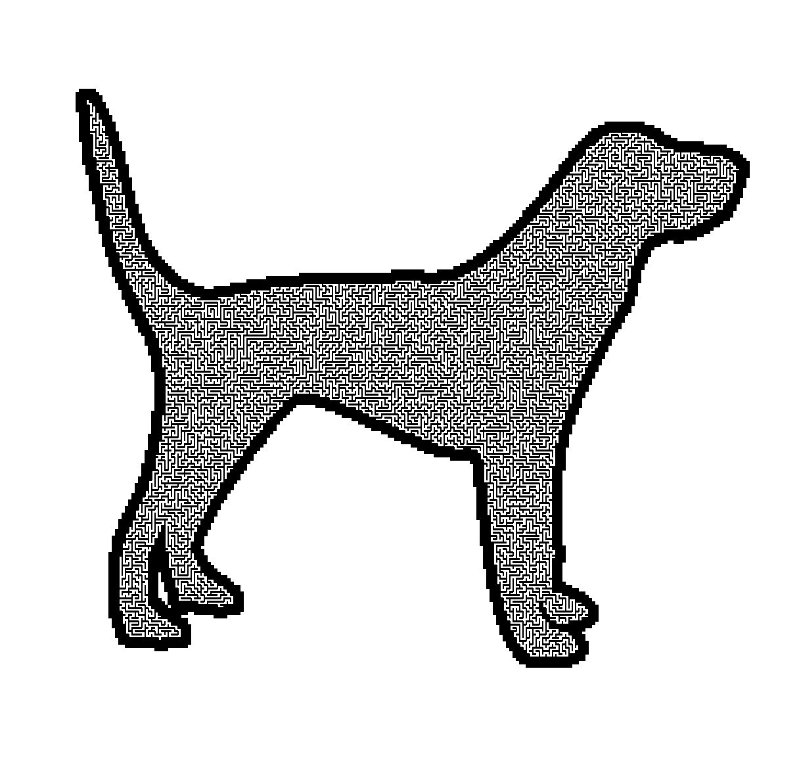
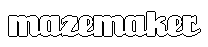

# [Try it out live](https://maze.dariusarnold.de)

Generate perfect (only a single solution without retracing steps) mazes
using recursive backtracing. All cells of the maze will be connected with each
other, meaning every point is reachable from every other point. 

Allows creating masked mazes by specifying an image.
A mask image limits the possible space for maze generation and allows to create 
mazes of arbitrary shapes. 
Also allows to automatically generate a mask from text.

## Requirements

 - Python >= 3.6
 - numpy
 - PIL
 - flask for the web interface

## Setup

1. Ensure you have `pip` and `venv` installed in your python distribution
2. Create a virtual environment called venv: `python -m venv venv`
3. Activate the virtual environment by `source venv/bin/activate
` (for Linux and MacOs) or `venv\Scripts\activate` (for Windows)
4. Install the requirements: `pip install -r requirements.txt`

### Local webserver

After activating the venv, run `python flask-app.py` to create a local instance of the web page.

## Usage

These are the things you can do
- Generate rectangular mazes
- Generate mazes within mask images (masks limit where mazes are generated)
- Generate text as a mask

### General options

These options can be specified for normal and masked maze generation. To select 
between the two, specify `generate` or `mask` after the general options. Both commands
have specific suboptions, see [Maze generation options](#maze-generation-options)
and [Mask image options](#mask-image-options).

```
$ python maze.py 
usage: maze.py [-h] [-f FILENAME] [-s SEED] [-o ORIGIN ORIGIN] [-c CELLSIZE] [-l LINEWIDTH] [-d FONTSIZE] [-b BORDERSIZE] {generate,mask} ...

Generate mazes.

positional arguments:
  {generate,mask}       Select between just maze generation with width/height or generating a maze with a mask.
    generate            Generate a maze within a rectangle.
    mask                Apply mask to limit maze.

options:
  -h, --help            show this help message and exit
  -f FILENAME, --filename FILENAME
                        Filename that is used to save the maze.
  -s SEED, --seed SEED  Seed for random generator.
  -o ORIGIN ORIGIN, --origin ORIGIN ORIGIN
                        x y coordinate of the start cell in the maze
  -c CELLSIZE, --cellsize CELLSIZE
                        Cell size in pixels for plotting.
  -l LINEWIDTH, --linewidth LINEWIDTH
                        Line width of cell walls for plotting in pixels.
  -d FONTSIZE, --fontsize FONTSIZE
                        Font size for text mask. Only used if text is specified.
  -b BORDERSIZE, --bordersize BORDERSIZE
                        Border size for text mask. Only used if text is specified.

```

### Maze generation options

The `generate` sub command generates rectangular mazes. You can specify the dimensions of maze and use all the basic 
arguments such as seed as well.

```
python maze.py generate -h
usage: maze.py generate [-h] width height

positional arguments:
  width       Width of the maze in cells.
  height      Height of the maze in cells.

optional arguments:
  -h, --help  show this help message and exit
```


Example:

```
$ python maze.py -f example.png -s mazemaker generate 100 50
```

Will generate a maze with the seed mazemaker, width of 100 and height of 50 cells
and save it in a file named example.png.



### Mask image options

Specify either a mask image or text for which a mask will be automatically created.

For mask images (`-m`): which mask image to use. One pixel of the mask image will be one cell 
in the final maze. Mask images are expected to be saved with 8-bit pixels, 
black and white. A black pixel blocks traversal of the algorithm, allowing to 
build walls.

For mask text (`-t`): Text used for mask generation. 

```
python maze.py mask -h
usage: maze.py mask [-h] [-m MASKIMG | -t TEXT]

options:
  -h, --help            show this help message and exit
  -m MASKIMG, --maskimg MASKIMG
                        Image to use as mask, where only white pixels can be visited by the algorithm, while black pixels are forbidden. If this is specified, the maze will be of the same dimensions as the mask image.
  -t TEXT, --text TEXT  Text to use as a mask where the maze is generate inside the text. If this is specified, the size of the maze is derived from the text and the fontsize and bordersize parameters.
```

Example:

```
python maze.py -f images/dogmaze.png -o 26 30 -l 2 mask -m images/dog_outline.png
```

Generate a maze from a mask image (dog_outline.png). Starting cell is pixel x:26,
 y:30 in the mask image. Wall thickness is two pixels. Save it in dogmaze.png
 
 
 
 
### Generating mask images from text
 
If you want to generate the maze inside the letters the font has to connect 
letters together. I found the Unicorn font from Nick Curtis which is free and can 
be downloaded from [DaFont](https://www.dafont.com/unicorn-nf.font). 
 
 ```
 python create_mask_image.py -h
usage: create_mask_image.py [-h] [-f FILENAME] [-s FONTSIZE] [-b BORDERSIZE]
                            [-i]
                            text

Generate a mask image to be used with the maze generator. This script creates
a mask image from the text string.Areas in black will be treated as walls by
the algorithm, acting as aborder of the maze generation.

positional arguments:
  text                  Text to be used as mask. Will be converted to lower
                        case

optional arguments:
  -h, --help            show this help message and exit
  -f FILENAME, --filename FILENAME
                        Filename under which the mask image will be saved.
  -s FONTSIZE, --fontsize FONTSIZE
                        Font size in points to use for text. A size <16 will
                        be too small for letters to connect with the default
                        Unicorn font.
  -b BORDERSIZE, --bordersize BORDERSIZE
                        Thickness of space around the text bounding box to the
                        image border in pixels.
  -i, --invert          Flag argument. If not specified (default) the letters
                        will be white with a black border. This means the maze
                        can be generated within the letters. Otherwise, if
                        this option is specified, the letters will be the
                        completely black and the maze will be generated around
                        them.
 ```
 
 Example:
 ```
 $ python create_mask_image.py mazemaker -b 8 -s 32
 ```
 
 Creates a mask image from the text mazemaker with font size 32 and border size 
 8. Saves in default mask.png in the current directory.
 
 